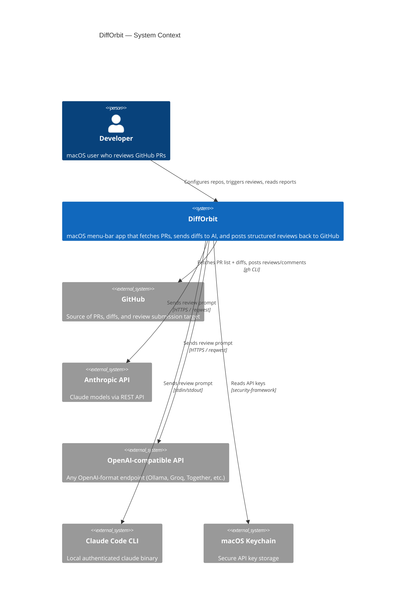
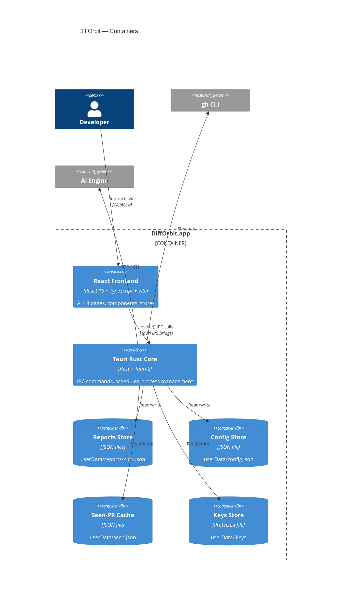
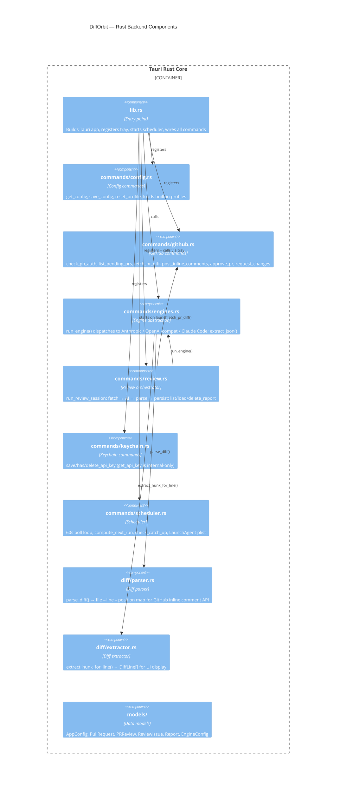
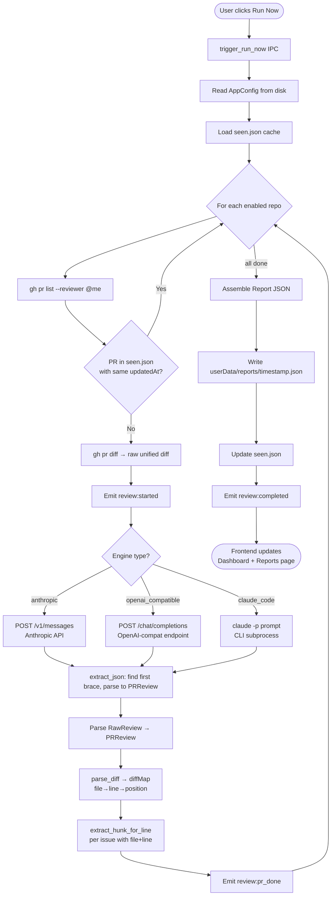
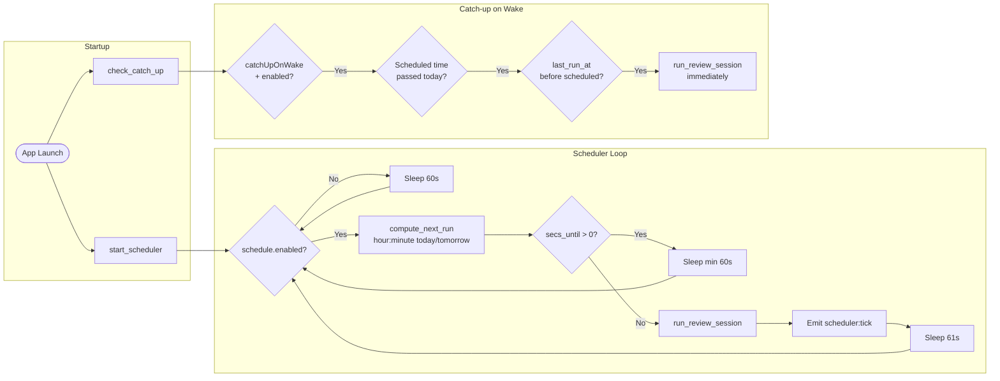
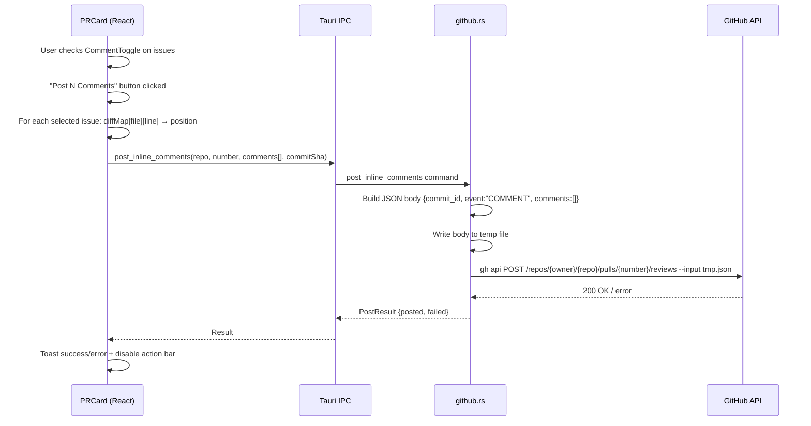
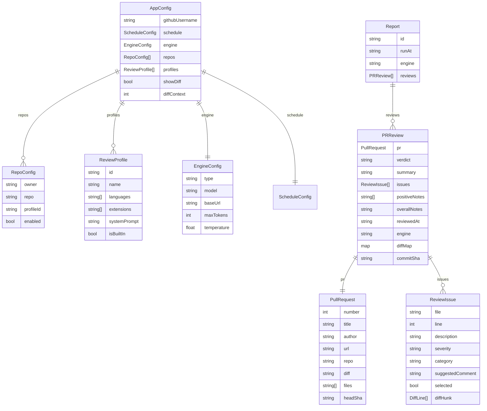

# DiffOrbit

> AI-powered PR code review desktop app for macOS

DiffOrbit lives in your menu bar and automatically reviews GitHub pull requests using AI — Anthropic Claude, any OpenAI-compatible endpoint, or your local Claude Code CLI session. Reviews are structured, inline-commented, and stored as local JSON reports you can browse at any time.

[](https://github.com/Pratik948/difforbit/actions/workflows/ci.yml)
[](https://github.com/Pratik948/difforbit/actions/workflows/release.yml)
---
## Features

- **Menu-bar app** — lives in the macOS tray, never in the Dock
- **Three AI engines** — Anthropic API, OpenAI-compatible (Ollama, Groq, Together, etc.), Claude Code CLI
- **Structured reviews** — verdict (APPROVE / REQUEST CHANGES / NEEDS DISCUSSION), issues with severity + category + inline diff hunks, positive notes
- **Post directly to GitHub** — batch inline comments, approve, or request changes without leaving the app
- **Seen-PR cache** — skips already-reviewed, unchanged PRs; force-re-review toggle
- **Cron scheduler** — daily scheduled runs at configurable hour:minute; catch-up-on-wake
- **LaunchAgent** — survives reboots via `~/Library/LaunchAgents/com.difforbit.app.plist`
- **8 built-in review profiles** — Flutter/Dart, React/TS, React Native, Swift, Kotlin, Java, C/C++, Generic
- **Custom profiles** — full system-prompt editor with JSON import/export
- **Report history** — persistent JSON reports with statistics (verdicts, issue breakdown, top repos)
- **Configurable themes** — Matrix (dark green), Shadcn Dark, Shadcn Light; persisted to localStorage

---

## Stack

| Layer | Technology |
|-------|-----------|
| Shell | Tauri 2 (Rust) |
| Frontend | React 18 + TypeScript + Vite |
| State | Zustand |
| Routing | React Router v6 (MemoryRouter) |
| Styling | shadcn/ui + Tailwind CSS v4 + custom `--do-*` token layer |
| GitHub | `gh` CLI (shell-out) |
| AI | `reqwest` HTTP (Anthropic/OpenAI) · `claude` CLI (Claude Code) |
| Storage | JSON files in `~/Library/Application Support/DiffOrbit/` |
| Keychain | File-based secrets store (macOS Keychain via security-framework in production) |

---

## Architecture

### C4 — Level 1: System Context



---

### C4 — Level 2: Container Diagram



---

### C4 — Level 3: Component Diagram — Rust Backend



---

### C4 — Level 3: Component Diagram — React Frontend

```mermaid
C4Component
  title DiffOrbit — React Frontend Components

  Container_Boundary(fe, "React Frontend") {
    Component(main, "main.tsx", "Entry", "applyTheme(), MemoryRouter, Toaster")
    Component(app, "App.tsx", "Root", "Two-column layout: Sidebar + routed main area")

    Component(sidebar, "layout/Sidebar.tsx", "Navigation", "Nav links, theme-aware sidebar")
    Component(windowframe, "layout/WindowFrame.tsx", "Chrome", "Header bar, wraps entire app")
    Component(traypopover, "layout/TrayPopover.tsx", "Tray UI", "Status, next run, Run Now — shown from tray")

    Component(dashboard, "pages/Dashboard.tsx", "Dashboard", "Run status, progress bar, next-run, last report link")
    Component(reports, "pages/Reports.tsx", "Reports list", "Report history stats + sortable list")
    Component(viewer, "pages/ReportViewer.tsx", "Report viewer", "Loads report, renders PRCard per review")
    Component(config, "pages/Configuration.tsx", "Configuration", "GitHub, repos, engine, schedule sections")
    Component(profiles, "pages/Profiles.tsx", "Profiles", "Two-column: list + ProfileEditor")

    Component(prcard, "review/PRCard.tsx", "PR Card", "Verdict, summary, issues list, action bar")
    Component(issucard, "review/IssueCard.tsx", "Issue Card", "Severity/category/file, comment, diff toggle")
    Component(diffview, "review/DiffViewer.tsx", "Diff Viewer", "Colour-coded add/remove/context/hunk rows")
    Component(verdict, "review/VerdictBadge.tsx", "Verdict Badge", "APPROVE / REQUEST_CHANGES / NEEDS_DISCUSSION")
    Component(toggle, "review/CommentToggle.tsx", "Comment Toggle", "Checkbox: include issue in batch post")

    Component(repolist, "config/RepoList.tsx", "Repo List", "Add/remove repos, profile picker, enable toggle")
    Component(engsel, "config/EngineSelector.tsx", "Engine Selector", "Radio + conditional fields + API key save/delete")
    Component(schedpick, "config/SchedulePicker.tsx", "Schedule Picker", "Hour/minute inputs, catch-up toggle, LaunchAgent")
    Component(profed, "config/ProfileEditor.tsx", "Profile Editor", "Name/languages/extensions/system-prompt, save/reset/delete")

    Component(stores, "store/", "Zustand stores", "reviewStore (run status, progress), configStore (AppConfig)")
    Component(hooks, "hooks/", "Hooks", "useTauriEvents, useScheduler")
    Component(ipc, "ipc/", "IPC wrappers", "Typed invoke() wrappers: config, github, review, engines")
    Component(types, "types/", "TypeScript types", "AppConfig, PullRequest, PRReview, Report, EngineConfig")
  }

  Rel(main, app, "renders")
  Rel(app, sidebar, "left column")
  Rel(app, dashboard, "route /")
  Rel(app, reports, "route /reports")
  Rel(app, viewer, "route /reports/:id")
  Rel(app, config, "route /configuration")
  Rel(app, profiles, "route /profiles")
  Rel(viewer, prcard, "one per PRReview")
  Rel(prcard, issucard, "one per issue")
  Rel(issucard, diffview, "expandable")
  Rel(issucard, toggle, "per issue")
  Rel(prcard, verdict, "header")
  Rel(dashboard, stores, "reads runStatus, progress")
  Rel(hooks, stores, "writes on Tauri events")
  Rel(config, ipc, "get_config / save_config")
  Rel(prcard, ipc, "post_inline_comments / approve / request_changes")
```



---

## Review Flow



---

## Scheduler Flow



---

## Data Flow — Posting Inline Comments



---

## Data Models



---

## File Structure

```
difforbit/
├── src-tauri/
│   ├── Cargo.toml
│   ├── tauri.conf.json
│   └── src/
│       ├── lib.rs                    ← app entry, tray, scheduler bootstrap
│       ├── main.rs
│       ├── commands/
│       │   ├── config.rs             ← get/save config, built-in profiles, reset_profile
│       │   ├── engines.rs            ← run_engine() → Anthropic / OpenAI / Claude Code
│       │   ├── github.rs             ← gh CLI wrappers
│       │   ├── keychain.rs           ← save/has/delete API keys (get is internal-only)
│       │   ├── review.rs             ← orchestrator, report CRUD
│       │   └── scheduler.rs          ← cron loop, catch-up, LaunchAgent plist
│       ├── diff/
│       │   ├── parser.rs             ← unified diff → position map
│       │   └── extractor.rs          ← hunk extraction for inline display
│       └── models/
│           ├── config.rs             ← AppConfig, RepoConfig, ScheduleConfig, ReviewProfile
│           ├── engine.rs             ← EngineConfig, RawReview (AI response shape)
│           ├── pr.rs                 ← PullRequest
│           └── review.rs             ← PRReview, ReviewIssue, Report, DiffLine
│
├── src/
│   ├── main.tsx                      ← applyTheme(), MemoryRouter, Toaster
│   ├── App.tsx                       ← two-column layout, all routes
│   ├── pages/
│   │   ├── Dashboard.tsx             ← run status, progress bar, next-run
│   │   ├── Reports.tsx               ← history stats + report list
│   │   ├── ReportViewer.tsx          ← full PRCard rendering per review
│   │   ├── Configuration.tsx         ← GitHub / repos / engine / schedule
│   │   └── Profiles.tsx              ← two-column profile editor
│   ├── components/
│   │   ├── layout/                   ← WindowFrame, Sidebar, TrayPopover
│   │   ├── review/                   ← PRCard, IssueCard, DiffViewer, VerdictBadge, CommentToggle
│   │   └── config/                   ← RepoList, EngineSelector, SchedulePicker, ProfileEditor
│   ├── hooks/
│   │   ├── useTauriEvents.ts         ← review:* event subscriptions
│   │   └── useScheduler.ts           ← scheduler:tick subscription + get_next_run_time
│   ├── store/
│   │   ├── reviewStore.ts            ← runStatus, progress, lastReportId
│   │   └── configStore.ts            ← AppConfig load/save
│   ├── ipc/                          ← typed invoke() wrappers
│   └── types/                        ← TypeScript interfaces (source of truth)
│
└── .phase-tracker/state.json         ← build progress (gitignored)
```

---

## Key Design Decisions

| Decision | Rationale |
|----------|-----------|
| **Tauri not Electron** | ~5 MB binary vs ~150 MB; native macOS APIs; WebKit rendering |
| **Rust layer is a thin shell** | Only shells out to `gh` and `claude`; no complex async orchestration in Rust |
| **OpenAI-compatible covers everything** | One engine type handles OpenAI, Ollama, Groq, Together, Mistral, any local model |
| **API keys never in config.json** | Written to `userData/.keys` (file-based; macOS Keychain in production); `get_api_key` is NOT an IPC command |
| **Reports as JSON files** | No database — simple, portable, inspectable; each report is self-contained |
| **shadcn/ui + token layer** | Components use `var(--do-*)` CSS vars; `applyTheme()` swaps all tokens; shadcn vars bridged in `App.css` |
| **MemoryRouter not BrowserRouter** | Tauri uses `tauri://` protocol; hash/history routing would need extra config |
| **Seen-PR cache by updatedAt** | Avoids re-reviewing unchanged PRs between runs; bypassed by force flag |
| **60s poll scheduler** | Simple, restartable, config-hot-reload on each tick; no cron crate dependency |

---

## Setup (Development)

### Prerequisites

```bash
# Rust
curl --proto '=https' --tlsv1.2 -sSf https://sh.rustup.rs | sh

# Node 20+
node --version  # must be >= 20

# GitHub CLI
brew install gh && gh auth login

# Claude Code CLI (only needed for claude_code engine)
npm install -g @anthropic-ai/claude-code && claude
```

### Install & run

```bash
# 1. Install frontend deps
npm install

# 2. Dev mode (opens Tauri window with hot-reload)
npm run tauri dev
```

### Build (macOS only)

```bash
npm run tauri build
# Output: src-tauri/target/release/bundle/dmg/DiffOrbit_*.dmg
```

---

## Storage Layout

All data is stored under `~/Library/Application Support/DiffOrbit/`:

```
~/Library/Application Support/DiffOrbit/
├── config.json          ← AppConfig (repos, schedule, engine, profiles)
├── .keys                ← API keys (never committed, never in config.json)
├── seen.json            ← { "owner/repo": { "42": { reviewed_at, updated_at } } }
└── reports/
    ├── 1711234567890.json
    ├── 1711234999000.json
    └── ...
```

---

## Tauri Events (Rust → Frontend)

| Event | Payload | Fired when |
|-------|---------|-----------|
| `review:started` | `{ total_prs: number }` | Review session begins |
| `review:pr_done` | `{ pr_number, verdict, issues_count }` | Each PR finishes |
| `review:completed` | `{ report_id: string }` | All PRs done, report written |
| `review:error` | `{ message: string }` | Any unrecoverable error |
| `scheduler:tick` | `{ next_run: string }` | Every 60s when scheduler is enabled |

---

## IPC Command Surface

```
config:    get_config · save_config · reset_profile
github:    check_gh_auth · list_pending_prs · fetch_pr_diff
           post_inline_comments · approve_pr · request_changes
keychain:  save_api_key · has_api_key · delete_api_key
review:    trigger_run_now · list_reports · load_report · delete_report
scheduler: get_next_run_time · trigger_run_now_cmd
           get_launch_agent_status · set_launch_agent
```

---

## Built-in Review Profiles

| Profile | Languages | Focus areas |
|---------|-----------|-------------|
| Generic | any | Correctness, readability, maintainability, security |
| React / TypeScript | TS, JS | Hook correctness, re-renders, type safety, accessibility |
| Flutter / Dart | Dart | Widget rebuilds, const constructors, null safety, state management |
| Swift | Swift | Memory management, retain cycles, async/await, optionals |
| Kotlin | Kotlin | Coroutine scope, null safety, Jetpack Compose recomposition |
| Java | Java | Exception handling, resource leaks, thread safety |
| React Native | TS, JS | Bridge calls, FlatList optimisation, native modules |
| C / C++ | C, C++ | Memory safety, buffer overflows, RAII, thread-safety |

---

## Pending (macOS dev machine required)

- [ ] **6.2** Proper app icon — 16/32/64/128/256/512/1024px `.icns`
- [ ] **6.3** Code signing — Apple Developer ID Application certificate
- [ ] **6.4** Notarisation — `xcrun notarytool` + `xcrun stapler`
- [ ] **6.5** DMG build — `npm run tauri build`
- [ ] **6.6** Auto-updater — `tauri-plugin-updater` + GitHub Releases JSON endpoint

---

## License

MIT
